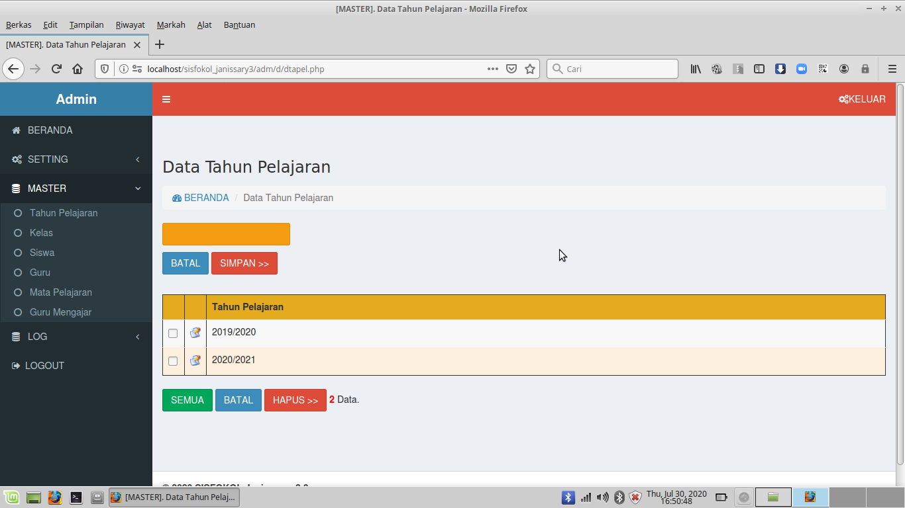
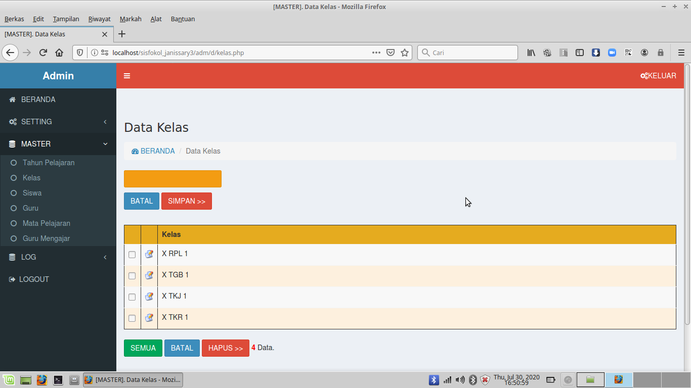

# sisfokol_janissary_3
sisfokol_janissary_3

SISFOKOL khusus E-Learning. Interaksi Guru dan Siswa. 

Dibuat dan dites dengan WebServer XAMPP PHP 7.4 . Pada LinuxMint.

Untuk konfigurasi, bisa set di file /inc/config.php

Untuk file database .sql, ada di folder /db

---

AKSES ADMIN :

User : admin , Pass : Sisfokol2020

---

CONTOH AKSES GURU :

user/pass : 170001

---

CONTOH AKSES SISWA :

user/pass : 280005

---

TAMPILAN AKSES ADMIN

 

 

 

 

 

 

 

 

 

 

 

